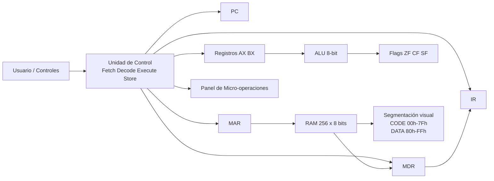

# Simulador de CPU 8-bit (Arquitectura)

Repositorio: https://github.com/misaelguzman-art/Parcial-1-arquitectura

Tablero Kanban (GitHub Projects): https://github.com/users/misaelguzman-art/projects

## 1) Descripción del proyecto
Este proyecto implementa un simulador didáctico de CPU de 8 bits en **Google Sheets + Google Apps Script**.
Incluye RAM de 256 posiciones (`00h` a `FFh`), registros visibles, banderas de estado, ciclo de instrucción por fases y ejecución en modo paso a paso o continuo.

---

## 2) Diagrama de bloques (Mermaid)

---

## 3) Plataforma de desarrollo
- **Entorno:** Google Sheets
- **Lógica:** Google Apps Script (JavaScript V8)
- **Archivo principal:** `/home/runner/work/Parcial-1-arquitectura/Parcial-1-arquitectura/src/Code.gs`

---

## 4) Memoria RAM (256x8)
La hoja `Simulator` representa las 256 direcciones en formato matricial con columnas:
- `Address` (`00h`..`FFh`)
- `Hex`
- `Binary`
- `Decimal/Mnemonic`
- `Segment` (separación visual CODE/DATA)

Segmentación implementada:
- **CODE:** `00h` a `7Fh`
- **DATA:** `80h` a `FFh`

---

## 5) CPU, registros y banderas
Se muestran dinámicamente los registros:
- `PC`, `IR`, `MAR`, `MDR`, `AX`, `BX`
- Banderas: `ZF`, `CF`, `SF`
- Estado ALU (`ALU`) y fase activa (`PHASE`)

---

## 6) Ciclo de instrucción
El simulador anima las 4 fases:
1. **Fetch** (Búsqueda)
2. **Decode** (Decodificación)
3. **Execute** (Ejecución)
4. **Store** (Almacenamiento)

Cada micro-operación queda registrada cronológicamente en la hoja `Trace`.

---

## 7) Interfaz y controles
Desde el menú `CPU Simulator`:
- `Inicializar`
- `Cargar Programa`
- `Paso a Paso`
- `Continuo` (retardo ajustable en `K2`)
- `Pausa`
- `Reset`

> Si se requieren botones visuales, en Google Sheets se pueden insertar dibujos y asignar estos mismos handlers.

---

## 8) ISA mínima formal
| Mnemonic | Tipo | Sintaxis | Efecto | Flags |
|---|---|---|---|---|
| MOV | Transferencia | `MOV dst, src` | `dst <- src` | No cambia |
| LOAD | Transferencia | `LOAD R, [addr]` | `R <- MEM[addr]` | No cambia |
| STORE | Transferencia | `STORE R, [addr]` | `MEM[addr] <- R` | No cambia |
| ADD | Aritmética | `ADD R1, R2/#imm` | `R1 <- R1 + op` | ZF, CF, SF |
| SUB | Aritmética | `SUB R1, R2/#imm` | `R1 <- R1 - op` | ZF, CF, SF |
| INC | Aritmética | `INC R` | `R <- R + 1` | ZF, CF, SF |
| DEC | Aritmética | `DEC R` | `R <- R - 1` | ZF, CF, SF |
| CMP | Lógica/Comparación | `CMP A, B` | `A - B` (solo flags) | ZF, CF, SF |
| JMP | Control de flujo | `JMP addr` | `PC <- addr` | No cambia |
| JZ | Control de flujo | `JZ addr` | Salta si `ZF=1` | No cambia |
| JNZ | Control de flujo | `JNZ addr` | Salta si `ZF=0` | No cambia |
| HLT | Control de flujo | `HLT` | Detiene CPU | No cambia |

---

## 9) Manual de usuario
1. Abrir la hoja de cálculo y ejecutar `Inicializar`.
2. Ejecutar `Cargar Programa` para cargar el programa de prueba.
3. Elegir modo:
   - `Paso a Paso` para observar fase por fase.
   - `Continuo` para correr automáticamente (ajustar ms en `K2`).
4. Usar `Pausa` para detener ejecución continua.
5. Usar `Reset` para restaurar estado inicial.
6. Revisar `Trace` para auditar la secuencia de micro-operaciones.

---

## 10) Programa de prueba y traza esperada
Programa cargado por defecto:
1. `MOV AX, #05h`
2. `MOV BX, #03h`
3. `ADD AX, BX`
4. `STORE AX, [80h]`
5. `CMP AX, #08h`
6. `JZ 07h`
7. `MOV AX, #00h`
8. `HLT`

Resultado esperado:
- `AX = 08h`
- `BX = 03h`
- `MEM[80h] = 08h`
- `ZF = 1` después de `CMP AX, #08h`
- El salto `JZ` lleva a `HLT`

Traza resumida esperada:
- Fetch/Decode/Execute/Store de cada instrucción
- Evento `HLT detectado. CPU detenida.` al final

---

## 11) Kanban propuesto (columnas y criterios)
Columnas requeridas:
- `Backlog`
- `To Do`
- `In Progress`
- `In Review / Testing`
- `Done`

Ejemplo de tarjetas con criterios de aceptación:
1. **RAM 256x8 con segmentación visual**
   - [ ] 256 direcciones visibles `00h..FFh`
   - [ ] Vista hex/bin/decimal-mnemónico
   - [ ] Separación clara CODE/DATA
2. **CPU + Flags + ALU**
   - [ ] Registros visibles y actualizados dinámicamente
   - [ ] Flags `ZF/CF/SF` funcionales
3. **Ciclo F-D-E-S y traza cronológica**
   - [ ] 4 fases animadas
   - [ ] Panel con micro-operaciones en orden
4. **Controles de ejecución**
   - [ ] Paso a paso
   - [ ] Continuo con delay configurable
   - [ ] Pausa / Reset / Carga de programa
5. **ISA mínima operativa**
   - [ ] Transferencia, aritmética/lógica y flujo implementados

---

## 12) Historial de commits
Se recomienda mantener commits semánticos y pequeños (`feat:`, `fix:`), evitando un único commit masivo.
