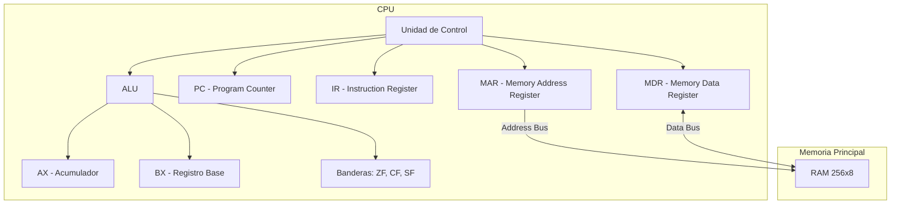

# Simulador de CPU de 8 bits (Arquitectura von Neumann)

Este proyecto es un simulador interactivo de una CPU de 8 bits con memoria de 256 bytes, desarrollado en Google Apps Script para ejecutarse dentro de Google Sheets. El sistema consta de una Unidad de Control, Registros (PC, IR, MAR, MDR, AX, BX), ALU y Memoria RAM, permitiendo la visualización paso a paso de las fases Fetch, Decode, Execute y Store.

## Diagrama de Bloques (Mermaid)

## Repertorio de Instrucciones (ISA)

| Instrucción | Opcode (Hex) | Bytes | Descripción |
|-------------|-------------|-------|-------------|
| `LOAD AX, [dir]`| `10 dir` | 2 | Carga en AX el contenido de la dirección en RAM |
| `LOAD BX, [dir]`| `11 dir` | 2 | Carga en BX el contenido de la dirección en RAM |
| `STORE [dir], AX`| `20 dir` | 2 | Guarda AX en la dirección de RAM especificada |
| `STORE [dir], BX`| `21 dir` | 2 | Guarda BX en la dirección de RAM especificada |
| `MOV AX, imm` | `30 imm` | 2 | Mueve el valor inmediato a AX |
| `MOV BX, imm` | `31 imm` | 2 | Mueve el valor inmediato a BX |
| `MOV AX, BX`  | `40` | 1 | Copia el valor de BX a AX |
| `MOV BX, AX`  | `41` | 1 | Copia el valor de AX a BX |
| `ADD AX, imm` | `50 imm` | 2 | Suma el inmediato a AX (AX = AX + imm) |
| `ADD BX, imm` | `51 imm` | 2 | Suma el inmediato a BX |
| `ADD AX, BX`  | `52` | 1 | Suma BX a AX (AX = AX + BX) |
| `SUB AX, imm` | `60 imm` | 2 | Resta el inmediato a AX |
| `SUB AX, BX`  | `62` | 1 | Resta BX a AX (AX = AX - BX) |
| `INC AX`      | `70` | 1 | Incrementa AX en 1 |
| `DEC BX`      | `81` | 1 | Decrementa BX en 1 |
| `CMP AX, BX`  | `92` | 1 | Compara AX con BX y actualiza banderas |
| `JMP dir`     | `A0 dir` | 2 | Salto incondicional a la dirección |
| `JZ dir`      | `B0 dir` | 2 | Salta si ZF=1 (Zero Flag activa) |
| `JNZ dir`     | `C0 dir` | 2 | Salta si ZF=0 (Zero Flag inactiva) |
| `HLT`         | `FF` | 1 | Detiene la ejecución |

## Programa de Prueba: Sucesión de Fibonacci

El siguiente programa carga en memoria la sucesión de Fibonacci calculando y almacenando los valores en variables dinámicas. Utiliza un contador en la dirección `FF` para detenerse tras N iteraciones.

Variables en memoria:
- `F0`: Valor A (inicial: `00h`)
- `F1`: Valor B (inicial: `01h`)
- `FF`: Contador de iteraciones (inicial: `0Ah` = 10 iteraciones)

**Análisis Paso a Paso (Código en RAM desde 00h):**
1. `00`: `10 F0` -> `LOAD AX, [F0]` (Carga A en AX)
2. `02`: `11 F1` -> `LOAD BX, [F1]` (Carga B en BX)
3. `04`: `52`    -> `ADD AX, BX`  (Calcula el nuevo número, AX = AX+BX)
4. `05`: `21 F0` -> `STORE [F0], BX` (B pasa a ser el nuevo A)
5. `07`: `20 F1` -> `STORE [F1], AX` (El nuevo número pasa a ser B)
6. `09`: `11 FF` -> `LOAD BX, [FF]` (Carga el contador en BX)
7. `0B`: `81`    -> `DEC BX` (Decrementa el contador)
8. `0C`: `21 FF` -> `STORE [FF], BX` (Guarda el contador decrementado)
9. `0E`: `B0 13` -> `JZ 13` (Si el contador llega a 0, ZF se activa y salta a HLT)
10. `11`: `A0 00` -> `JMP 00` (De lo contrario, salta al inicio del ciclo)
11. `13`: `FF`    -> `HLT` (Fin de ejecución)